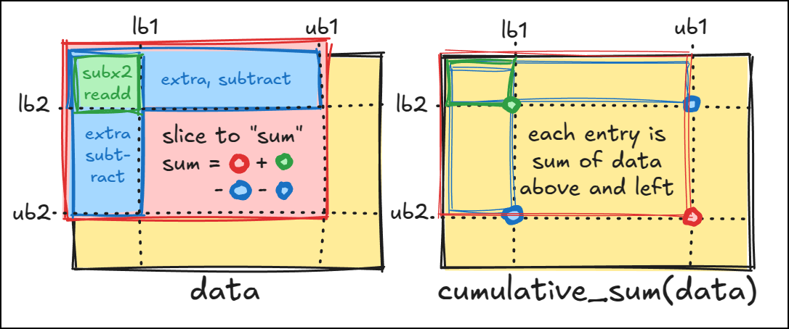

.. _contact_matrix:

===========================================================================
Cumulative sums primer and rapid contact matrix processing
===========================================================================

.. contents:: Table of Contents
   :depth: 3

Cumulative sums, 1D basics
--------------------------

ContactMatrixStack uses a precomputed 2D partialsum array for efficient region-based queries. To explain
start with the 1D partialsum case. ``DATA`` is a 1D array and ``SUMS`` is the cumulative sum
of ``DATA`` (``ipd.partialsum(DATA)``. If we want the sum of ``DATA[i:j]`` we can compute it as
``SUMS[j] - SUMS[i]``.

.. code-block:: python

    Index:          0     1     2     3     4
    DATA:         [ 2 ] [ 7 ] [ 1 ] [ 3 ] [ 5 ]
                  \___________________________/
    Cumulative
    Sum (SUM):   [ 0 ] [ 2 ] [ 9 ] [ 10 ] [ 13 ] [ 18 ]
    Index:         ^     ^     ^      ^      ^      ^
                   0     1     2      3      4      5
                 (think of SUM[4] = sum of DATA[:4])

To find the sum of ``DATA[lb:ub]``, use ``SUM[ub] - SUM[lb]``. ``SUMS[ub]`` will be the sum of
``DATA[:ub]`` and ``SUMS[lb]`` will be the sum of ``DATA[:lb]``. So, ``SUM[ub] - SUM[lb]`` will be
the sum of ``DATA[lb:ub]``. The key observation is that ``SUM[ub]`` is the sum of elements ``DATA[0:ub]``, so it “overcounts” all elements up to ``lb``.    Subtracting ``SUM[lb]`` precisely
removes that overcount, leaving just the slice from ``lb`` to ``ub``.

Cumsum Performance Example
--------------------------
Setup

>>> import numpy as np
>>> import ipd
>>> data = np.random.rand(500)
>>> sums = np.zeros(len(data)+1)
>>> sums[1:] = ipd.partialsum(data)
>>> slice_sums1 = np.zeros((len(data), len(data)))
>>> slice_sums2 = np.zeros((len(data), len(data)))
>>> timer = ipd.dev.Timer('Cumsum Perf Example')

Compute all sums the brute force way

>>> for i in range(len(data)):
...     for j in range(i, len(data)):
...         slice_sums1[i, j] = data[i:j].sum()
>>> _ = timer.checkpoint('dumb way, summing explicitly like a barbarian')

Compute all sums using partialsum

>>> for i in range(len(data)):
...     for j in range(i, len(data)):
...         slice_sums2[i, j] = sums[j] - sums[i]
>>> _ = timer.checkpoint('kinda smarter way using partialsum')

Compute all sums using partialsum without loops

>>> slice_sums3 = np.maximum(0, sums[None, :-1] - sums[:-1, None])
>>> _ = timer.checkpoint('big brain way using partialsum and numpy broadcasting')

Verify results

>>> np.allclose(slice_sums1, slice_sums2)
True
>>> np.allclose(slice_sums1, slice_sums3)
True
>>> # check runtimes, note how much faster partialsum + broadcasting is
>>> timer.report(timecut=0)  # doctest: +SKIP
Timer.report: Cumsum Perf Example order=longest: summary: sum
   0.19970 * dumb way, summing explicitly like a barbarian
   0.03875 * kinda smarter way using partialsum
   0.00078 * big brain way using partialsum and numpy broadcasting

Cumulative sums, 2D
-------------------

Note how much faster the partialsum + broadcasting version was for the 1D version, almost 1000x faster.
It makes an even bigger difference in the 2D case because the arrays tend to be much larger.

   Illustration of data 2D with pink region to be "summed" and 2D cumulative sum array from which four points are needed to computs the "sum:" ``sum = CSUM[ub1,ub2] (red point) + CSUM[lb1,lb2] (green point) - CUSM[ub1,lb2] (blue point) - CSUM[lb1,lb2] (blue point``.

The method :py:meth:`ContactMatrixStack.fragment_contact` uses this idea to compute the total contacts of all
pairs of fragments of a given length using a 2D partialsum array. The stride parameter allows for computing only evey Nth value. Note, even on large inputs, this function is fast enough to
compute every fragment pair, so stride is mainly useful as simple way to reduce redundancy.

>>> def fragment_contact(self, fragsize, stride=1):
...   result = (
...     self.partialsum[:, fragsize:         :stride, fragsize:         :stride] -
...     self.partialsum[:, fragsize:         :stride,         :-fragsize:stride] -
...     self.partialsum[:,         :-fragsize:stride, fragsize:         :stride] +
...     self.partialsum[:,         :-fragsize:stride,         :-fragsize:stride] )

This function retuns an ``S x M x N`` array containing the total contacts for all pairs of fragments for each contact matrix s in the stack: ``fragment1`` starting at m ending at ``m + fragsize``, to fragment2 starting at ``n`` and ending at ``n - fragsize``.

The method :py:meth:`ContactMatrixStack.topk_fragment_contact_by_subset_summary` uses the
arrays produced by
:py:meth:`ContactMatrixStack.fragment_contact` to search for subsets of subunits that
all "multibody" contacts by enumerating all subsets of contacting subunits, and taking
the minimum number of contacts for each fragment pair. See the example below.

.. _contact_matrix_overview:

ContactMatrixStack Example
---------------------------

Setup, reading in and positioning some data

>>> top7 = ipd.atom.body_from_file('1qys').centered
>>> dxh = ipd.atom.symbody_from_file('1dxh').centered
>>> dxh.contacts(top7).total_contacts  # lots, both are centered
3033
>>> top7 = top7.slide_into_contact(dxh, [1, 0, 0])  # just touching
>>> top7 = top7.movedby([15,0,0]) # now way clashing, but lots of contacts
>>> contacts = dxh.contacts(top7, radius=6)

Get best pair of fragment

>>> cmat = contacts.contact_matrix_stack()
>>> cmat
ContactMatrixStack(shape: (4, 92, 335) subs: [ 2  6  8 10])
>>> # 4 contact matrices, thus top7 contacts 4 (of 12) subunit in dxh
>>> pair_frag_contacts = cmat.fragment_contact(fragsize=20, stride=5)
>>> isub, itop7, idxh = np.unravel_index(np.argmax(pair_frag_contacts), pair_frag_contacts.shape)
>>> best_ncontact = pair_frag_contacts[isub, itop7, idxh]
>>> f'best frag pair is top7 resi {itop7}-{itop7+19} to dxh sub {cmat.subs[isub]} resi {idxh}-{idxh+19}'
'best frag pair is top7 resi 4-23 to dxh sub 8 resi 0-19'

Get fragments pairs with multiple subunit contacts

>>> args = dict(fragsize=10, stride=4, k=20, summary=np.min)
>>> bestfrags = cmat.topk_fragment_contact_by_subset_summary(**args)
>>> list(bestfrags.index.keys())
[(0, 2), (0,), (1,), (2,), (3,)]

bestfrags.index and bestfrags.vals are dicts mapping a set of subunits to fragment pairs that have contacts involving all the subunits. The subsets ``(0,), (1,), (2,), (3,)`` contain only one subunit, but there is one subset (0, 2), indicating fragment pairs that contact both subunit 0 and subunit 2.

>>> f'subunits in 1dxh {[int(cmat.subs[i]) for i in (0, 2)]}'
'subunits in 1dxh [2, 8]'
>>> bestfrags.index[0, 2].shape, bestfrags.vals[0,2].shape
((2, 7), (7,))
>>> np.concatenate([bestfrags.index[0, 2].T, bestfrags.vals[0,2][:,None]], axis=1)
array([[ 32, 112,  11],
       [ 28, 112,   6],
       [ 28, 116,   6],
       [ 36,   0,   1],
       [ 32,   0,   1],
       [ 36,   4,   1],
       [ 32,   4,   1]], dtype=int32)

This tells us that top7 resi ``32-51`` has **at least** 11 contacts to *both*
1dxh subunit 2 resi ``112-131`` *and* 1dxh subunit 8 resi ``112-131``. Lets get the atoms
and see if it's legit.

>>> top7frag = top7.positioned_atoms[np.isin(top7.atoms.res_id, range(32, 52))]
>>> dxhfrag1 = dxh.bodies[2].positioned_atoms[np.isin(dxh.bodies[2].atoms.res_id, range(112, 132))]
>>> dxhfrag2 = dxh.bodies[8].positioned_atoms[np.isin(dxh.bodies[8].atoms.res_id, range(112, 132))]
>>> ipd.atom.dump(top7frag, '/tmp/top7frag.cif')
>>> ipd.atom.dump(dxhfrag1, '/tmp/dxhfrag1.cif')
>>> ipd.atom.dump(dxhfrag2, '/tmp/dxhfrag2.cif')
>>> # ipd.showme(top7frag, name='top7', force=True)
>>> # ipd.showme(dxhfrag1, name='dxh1', force=True)
>>> # ipd.showme(dxhfrag2, name='dxh2', force=True)
>>> # ipd.showme(dxh, force=True)
>>> # ipd.showme(top7, force=True)

.. figure:: ../_static/img/contact_matrix_topk_frag__example.png
   :alt: Top7 / 1dxh fragment contact example

   Screenshot from pymol (as launched by ipd.showme). These contacts are't super good, but this
   is a totally arbitrary "dock" of top7 to 1dxh, not a real biological interface. (probably should
   have used a real biological interface for this example...) There may also be slightly better
   fragments if stride is set to 1.

Note: :py:func:`ipd.viz.pymol_viz.showme` (just call ipd.showme) is super useful for visualizing all kinds of things, mainly in pymol.
 It can show AtomArrays, Bodies, Symbodies, homogeneous transforms, stacks of xyz coords, symmetry
 elements, crystal lattices, etc etc. All you need is pymol in your conda environment, and runnable.
